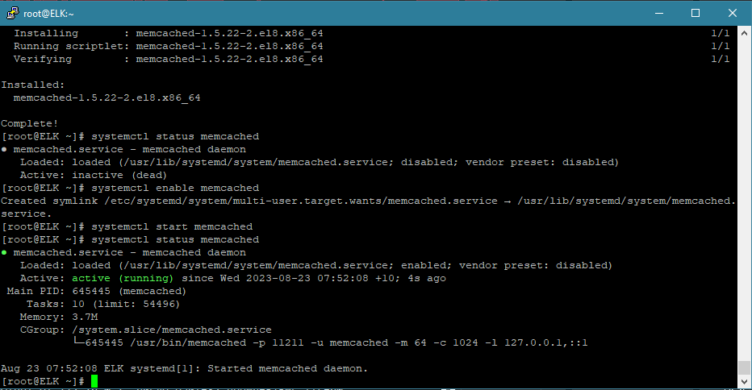
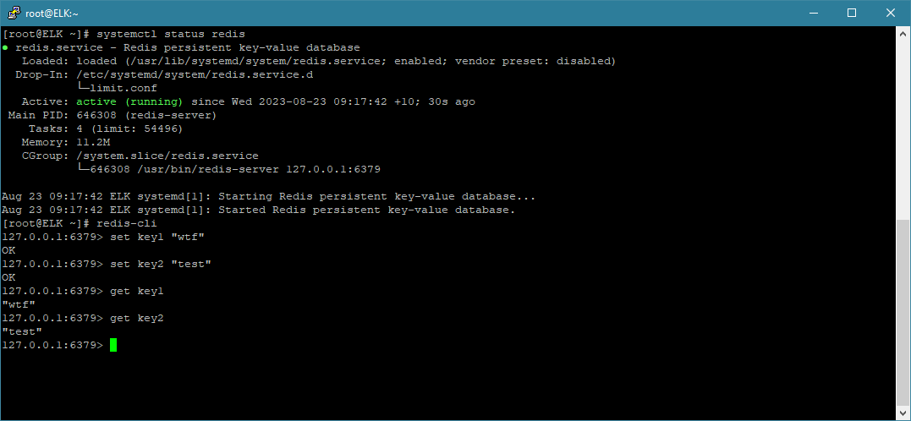

# Домашнее задание к занятию «Кеширование Redis/memcached»
---
### Задание 1. Кеширование 

Приведите примеры проблем, которые может решить кеширование. 

#### Ответ
* Повышение производительности
* Увеличение скорости ответа
* Экономия ресурсов
* Сглаживание бустов трафика

---

### Задание 2. Memcached

Установите и запустите memcached.
Приведите скриншот systemctl status memcached, где будет видно, что memcached запущен.

* systemctl status memcached 
---

### Задание 3. Удаление по TTL в Memcached

Запишите в memcached несколько ключей с любыми именами и значениями, для которых выставлен TTL 5. 
Приведите скриншот, на котором видно, что спустя 5 секунд ключи удалились из базы.
* скриншот 
---

### Задание 4. Запись данных в Redis

Запишите в Redis несколько ключей с любыми именами и значениями. 
Через redis-cli достаньте все записанные ключи и значения из базы, приведите скриншот этой операции.
* скриншот 

## Дополнительные задания (со звёздочкой*)
Эти задания дополнительные, то есть не обязательные к выполнению, и никак не повлияют на получение вами зачёта по этому домашнему заданию. Вы можете их выполнить, если хотите глубже разобраться в материале.

### Задание 5*. Работа с числами 

Запишите в Redis ключ key5 со значением типа "int" равным числу 5. Увеличьте его на 5, чтобы в итоге в значении лежало число 10.  

*Приведите скриншот, где будут проделаны все операции и будет видно, что значение key5 стало равно 10.*
