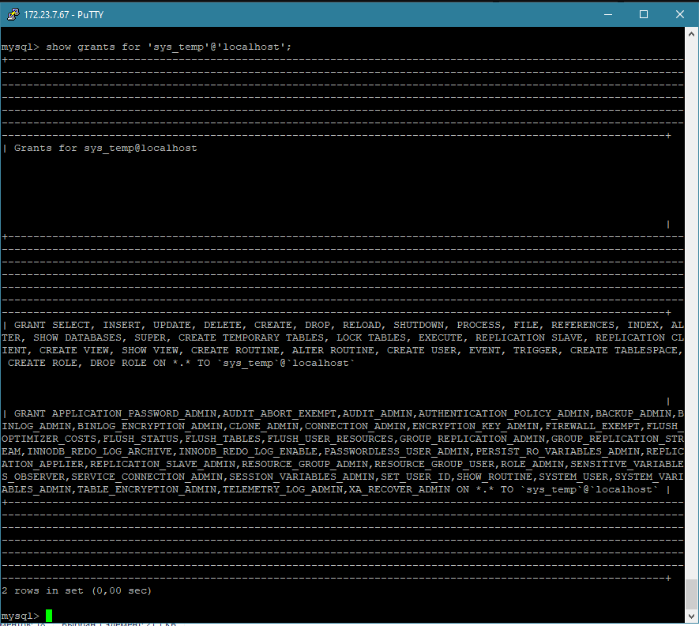

# Домашнее задание к занятию «Работа с данными (DDL/DML)» - Бровко И.Г.

### Инструкция по выполнению домашнего задания

---

### Задание 1
1.1. Поднимите чистый инстанс MySQL версии 8.0+. Можно использовать локальный сервер или контейнер Docker.


1.2. Создайте учётную запись sys_temp. 


1.3. Выполните запрос на получение списка пользователей в базе данных. (скриншот)


1.4. Дайте все права для пользователя sys_temp. 


1.5. Выполните запрос на получение списка прав для пользователя sys_temp. (скриншот)


1.6. Переподключитесь к базе данных от имени sys_temp.


Для смены типа аутентификации с sha2 используйте запрос: 
```sql
ALTER USER 'sys_test'@'localhost' IDENTIFIED WITH mysql_native_password BY 'password';
```


1.6. По ссылке https://downloads.mysql.com/docs/sakila-db.zip скачайте дамп базы данных.


1.7. Восстановите дамп в базу данных.
- для восстановления базы сначала надо создать куда будет происходить восстановление
- CREATE DATABASE sakila DEFAULT CHARACTER SET utf8 DEFAULT COLLATE utf8_general_ci;

- обьявляем переменную с именем базы 
- export DBNAME=sakila

- восстановливаем базу данных из дампа
- mysql -u root -p ${sakila}< sakila-schema.sql
- mysql -u root -p ${sakila}< sakila-data.sql


1.8. При работе в IDE сформируйте ER-диаграмму получившейся базы данных. При работе в командной строке используйте команду для получения всех таблиц базы данных. (скриншот)


*Результатом работы должны быть скриншоты обозначенных заданий, а также простыня со всеми запросами.*


### Задание 2
Составьте таблицу, используя любой текстовый редактор или Excel, в которой должно быть два столбца: в первом должны быть названия таблиц восстановленной базы, во втором названия первичных ключей этих таблиц. Пример: (скриншот/текст)
```
Название таблицы | Название первичного ключа
customer         | customer_id
```


## Дополнительные задания (со звёздочкой*)
Эти задания дополнительные, то есть не обязательные к выполнению, и никак не повлияют на получение вами зачёта по этому домашнему заданию. Вы можете их выполнить, если хотите глубже шире разобраться в материале.

### Задание 3*
3.1. Уберите у пользователя sys_temp права на внесение, изменение и удаление данных из базы sakila.

3.2. Выполните запрос на получение списка прав для пользователя sys_temp. (скриншот)
- задаем правва SELECT юзеру sys_temp на базу sakila
- GRANT SELECT, SELECT ON sakila . * TO 'sys_temp'@'localhost';


*Результатом работы должны быть скриншоты обозначенных заданий, а также простыня со всеми запросами.*
