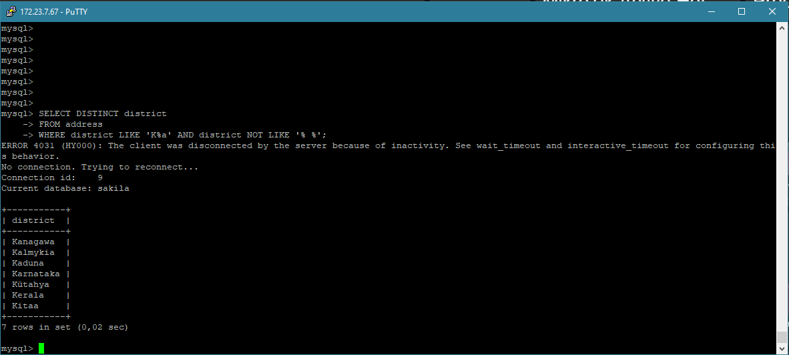
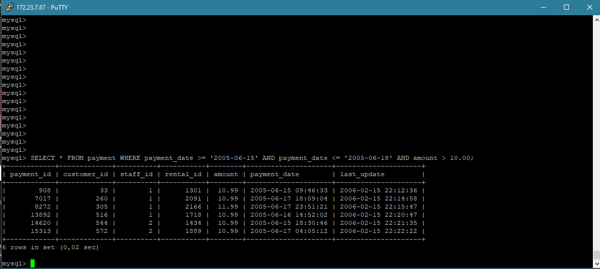
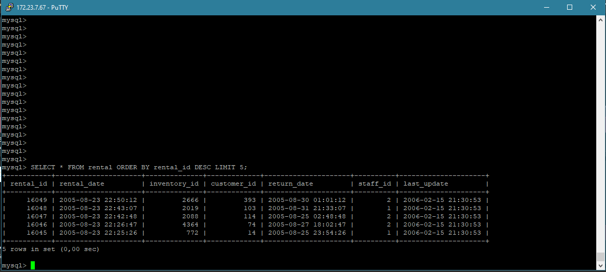
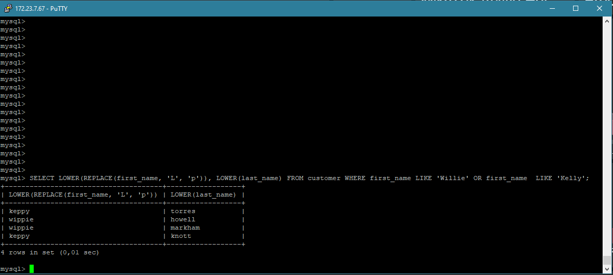
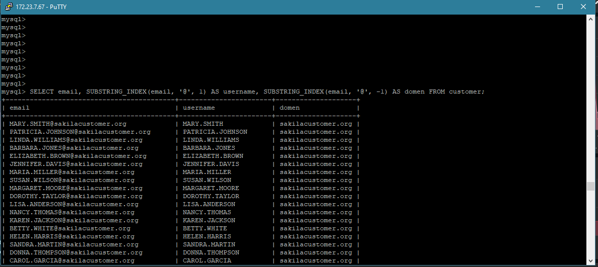
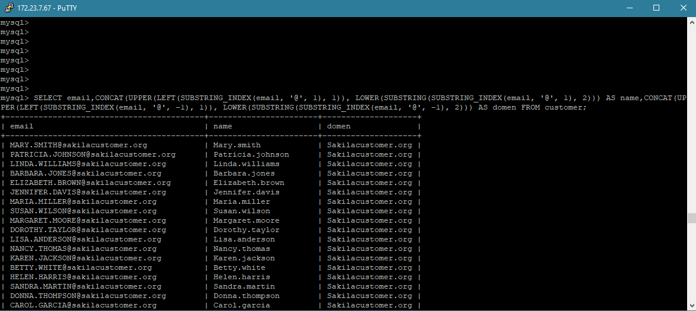

# Домашнее задание к занятию «SQL. Часть 1» - Бровко Иван Геннадьевич

---

### Задание 1

Получите уникальные названия районов из таблицы с адресами, которые начинаются на “K” и заканчиваются на “a” и не содержат пробелов.

- SELECT DISTINCT district FROM address WHERE district LIKE 'K%a' AND district NOT LIKE '% %';

---
### Задание 2

Получите из таблицы платежей за прокат фильмов информацию по платежам, которые выполнялись в промежуток с 15 июня 2005 года по 18 июня 2005 года **включительно** и стоимость которых превышает 10.00.

- SELECT * FROM payment WHERE payment_date >= '2005-06-15' AND payment_date <= '2005-06-18' AND amount > 10.00;

---
### Задание 3

Получите последние пять аренд фильмов.

- SELECT * FROM rental ORDER BY rental_id DESC LIMIT 5;

---
### Задание 4

Одним запросом получите активных покупателей, имена которых Kelly или Willie. 

Сформируйте вывод в результат таким образом:
- все буквы в фамилии и имени из верхнего регистра переведите в нижний регистр,
- замените буквы 'll' в именах на 'pp'.

- SELECT LOWER(REPLACE(first_name, 'L', 'p')), LOWER(last_name) FROM customer WHERE first_name LIKE 'Willie' OR first_name  LIKE 'Kelly';

---

### Задание 5*

Выведите Email каждого покупателя, разделив значение Email на две отдельных колонки: в первой колонке должно быть значение, указанное до @, во второй — значение, указанное после @.

- SELECT	email, SUBSTRING_INDEX(email, '@', 1) AS username, SUBSTRING_INDEX(email, '@', -1) AS domen FROM customer;

---
### Задание 6*

Доработайте запрос из предыдущего задания, скорректируйте значения в новых колонках: первая буква должна быть заглавной, остальные — строчными.

- SELECT	email,	CONCAT(UPPER(LEFT(SUBSTRING_INDEX(email, '@', 1), 1)), LOWER(SUBSTRING(SUBSTRING_INDEX(email, '@', 1), 2))) AS name,	CONCAT(UPPER(LEFT(SUBSTRING_INDEX(email, '@', -1), 1)), LOWER(SUBSTRING(SUBSTRING_INDEX(email, '@', -1), 2))) AS domen FROM customer;

