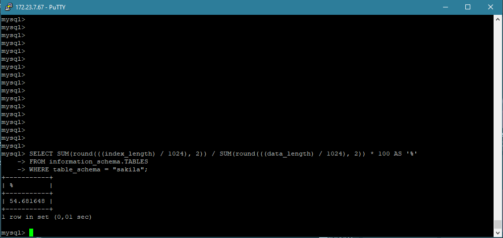
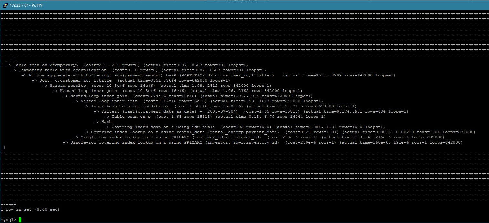
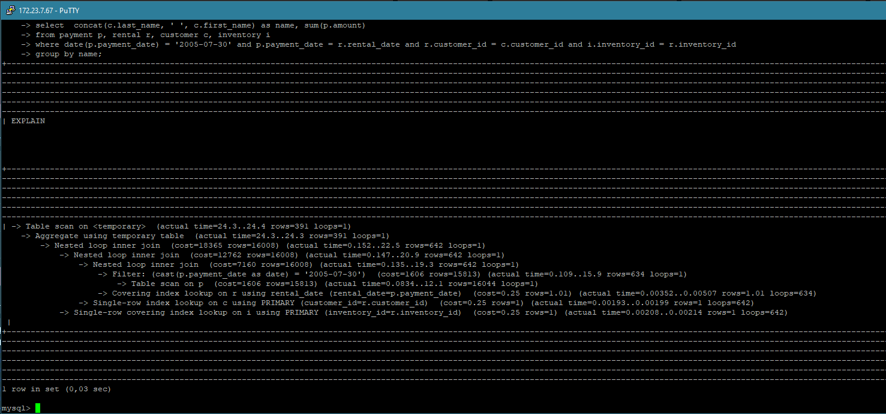

# Домашнее задание к занятию «Индексы» - Бровко Иван Геннадьевич

---

### Задание 1

Напишите запрос к учебной базе данных, который вернёт процентное отношение общего размера всех индексов к общему размеру всех таблиц.
```
SELECT (SUM(INDEX_LENGTH) / SUM(DATA_LENGTH)) * 100 AS percent
FROM information_schema.TABLES
WHERE TABLE_SCHEMA = 'sakila';
```


### Задание 2

Выполните explain analyze следующего запроса:
```
EXPLAIN ANALYZE
select distinct concat(c.last_name, ' ', c.first_name), sum(p.amount) over (partition by c.customer_id, f.title)
from payment p, rental r, customer c, inventory i, film f
where date(p.payment_date) = '2005-07-30' and p.payment_date = r.rental_date and r.customer_id = c.customer_id and i.inventory_id = r.inventory_id;
```



* оптимизированный запрос explain analyze
```
EXPLAIN ANALYZE
SELECT DISTINCT CONCAT(c.last_name, ' ', c.first_name), SUM(p.amount) OVER (PARTITION BY c.customer_id, f.title)
FROM payment p
JOIN rental r ON r.rental_id = p.rental_id 
JOIN customer c ON c.customer_id = r.customer_id 
JOIN inventory i ON i.inventory_id = r.inventory_id 
JOIN film f ON f.film_id = i.film_id 
WHERE p.payment_date = '2005-07-30' 
AND r.rental_date = p.payment_date 
AND c.customer_id IN (SELECT r.customer_id FROM rental r WHERE r.rental_date = p.payment_date) 
AND i.inventory_id IN (SELECT r.inventory_id FROM rental r WHERE r.rental_date = p.payment_date);
```


* удалил некоторые таблицы, добавил join-ы, в результате стоимость уменьшилось в разы.


- сканирует все таблицы из за этого высокая стоимость
