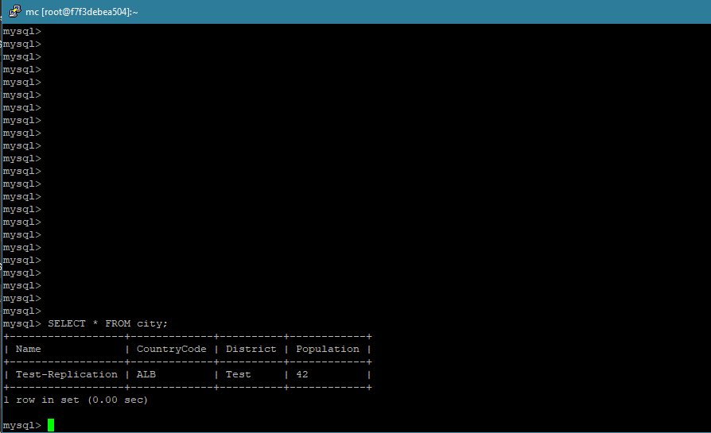

# Домашнее задание к занятию «Репликация и масштабирование. Часть 1» - Бровко Иван Геннадьевич

---

### Задание 1

На лекции рассматривались режимы репликации master-slave, master-master, опишите их различия.

* В режиме master-slave все изменения возможны только на мастере, данные на слейве по поределению доступны только для чтения чтения, также из-за особенности архитектуры слейв потребляет гораздо больше ресурсов чем мастер. В режиме master-master каждый сервер является и мастером и слейвом.

---

### Задание 2

Выполните конфигурацию master-slave репликации, примером можно пользоваться из лекции.
* выполенена конфигурация master-slave репликации
* статус мастера 
* конфигурация мастера 
* статус слейва 
* конфигурация слейва 

* Попробуем изменить данные на мастере:
```
docker exec -it replication-master mysql
mysql> USE world;
mysql> INSERT INTO city (Name, CountryCode, District, Population) VALUES ('Test-Replication', 'ALB', 'Test', 42);
```
* проверяем, появились ли они на слейве
```
docker exec -it replication-slave mysql
mysql> USE world;
mysql> SELECT * FROM city;
```
* 

---
* весь процесс 
