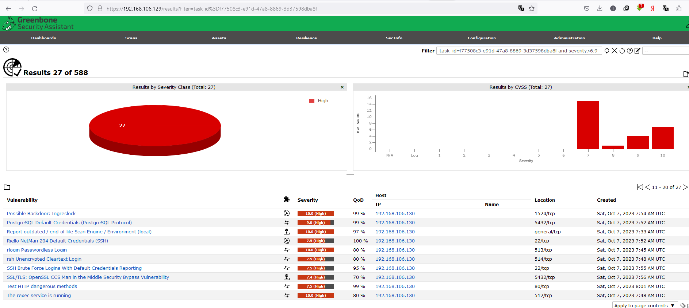
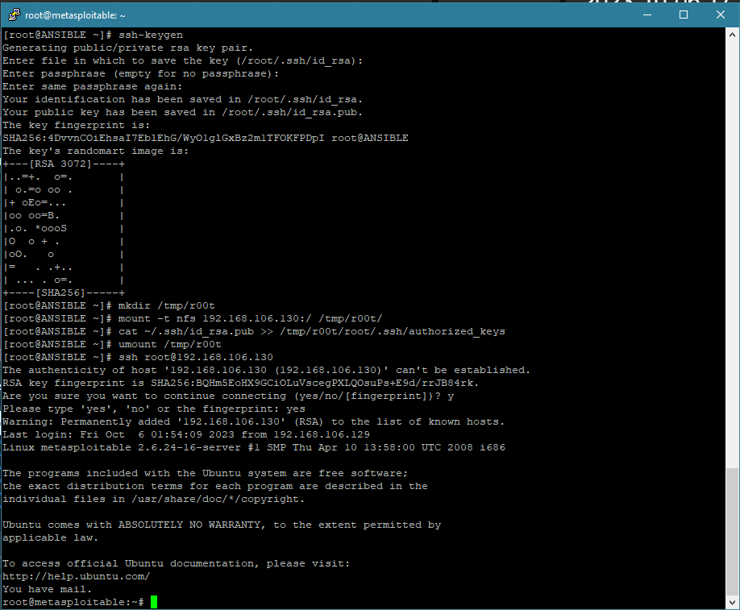

# Домашнее задание к занятию «Уязвимости и атаки на информационные системы» - Бровко Иван Геннадьевич

------

### Задание 1

Скачайте и установите виртуальную машину Metasploitable: https://sourceforge.net/projects/metasploitable/.

* **Виртуальная машина скачана и установлена**
* скрин 

Это типовая ОС для экспериментов в области информационной безопасности, с которой следует начать при анализе уязвимостей.

Просканируйте эту виртуальную машину, используя **nmap**.
* **nmap -sVC  192.168.106.130**
* **Лог сканирования виртуальной машины**
* 

Попробуйте найти уязвимости, которым подвержена эта виртуальная машина.

Сами уязвимости можно поискать на сайте https://www.exploit-db.com/.

Для этого нужно в поиске ввести название сетевой службы, обнаруженной на атакуемой машине, и выбрать подходящие по версии уязвимости.

Ответьте на следующие вопросы:

- Какие сетевые службы в ней разрешены?
* **Список разрешенных сетевых служб**
```
PORT     STATE SERVICE     VERSION
21/tcp   open  ftp         vsftpd 2.3.4
22/tcp   open  ssh         OpenSSH 4.7p1 Debian 8ubuntu1 (protocol 2.0)
23/tcp   open  telnet      Linux telnetd
25/tcp   open  smtp        Postfix smtpd
53/tcp   open  domain      ISC BIND 9.4.2
80/tcp   open  http        Apache httpd 2.2.8 ((Ubuntu) DAV/2)
111/tcp  open  rpcbind     2 (RPC #100000)
139/tcp  open  netbios-ssn Samba smbd 3.X - 4.X (workgroup: WORKGROUP)
445/tcp  open  netbios-ssn Samba smbd 3.X - 4.X (workgroup: WORKGROUP)
512/tcp  open  exec        netkit-rsh rexecd
513/tcp  open  login       OpenBSD or Solaris rlogind
514/tcp  open  shell       Netkit rshd
1099/tcp open  java-rmi    GNU Classpath grmiregistry
1524/tcp open  bindshell   Metasploitable root shell
2049/tcp open  nfs         2-4 (RPC #100003)
2121/tcp open  ftp         ProFTPD 1.3.1
3306/tcp open  mysql       MySQL 5.0.51a-3ubuntu5
5432/tcp open  postgresql  PostgreSQL DB 8.3.0 - 8.3.7
5900/tcp open  vnc         VNC (protocol 3.3)
6000/tcp open  X11         (access denied)
6667/tcp open  irc         UnrealIRCd
8009/tcp open  ajp13       Apache Jserv (Protocol v1.3)
8180/tcp open  http        Apache Tomcat/Coyote JSP engine 1.1
```

---
- Какие уязвимости были вами обнаружены? (список со ссылками: достаточно трёх уязвимостей)
- 21/tcp   open  ftp         vsftpd 2.3.4, https://www.exploit-db.com/exploits/17491
- 512/tcp  open  exec        netkit-rsh rexecd, https://www.exploit-db.com/exploits/48170
- 513/tcp  open  login       OpenBSD or Solaris rlogind, https://www.exploit-db.com/exploits/19203
- 2049/tcp open  nfs         2-4 (RPC #100003), https://www.exploit-db.com/exploits/14003
-  
---
- можно применить алтернативный метод сканирования на уязвимости, например openVAS(gvm)
- устанвилваю openVAS(gvm), настраиваю scan config, создаю task, приступаю к сканированию
- 
- 
- обнаружено уязвимостей класса HIGH - 27, класса MEDIUM - 38, остальные нам мало интересны
- 
- обнаруденные уязвимости со статусом HIGH
- 
- 
- 
---

 
 
---
* **Если посмотреть Лог сканирования виртуальной машины то можно увидеть обнаруженные уязвимости**

* **Попробуем на практике проверить некоторые уязвимости и получить доступ**
```
1. уязвимость TCP ports 512, 513, and 514 are known as "r" services | позволяет получить доступ к консоли с любого хоста
512/tcp   open  exec
513/tcp   open  login
514/tcp   open  shell
устанавливаем rsh-client и пробуем подключаться к жертве :-)
```

* скрин 

---

```
2. Уязвимость на порту 2049/tcp open  nfs         2-4 (RPC #100003)
эта уязвмость позволяет получить доступ к файловой системе, подкинуть свой ключик и подключиться по ssh
```

* скрин 
* скрин 

---

3. уязвимость на порту 22/tcp   open  ssh         OpenSSH 4.7p1 Debian 8ubuntu1 (protocol 2.0) | видим ssh ключи

```
4. уязвимость на порту 1524/tcp open  bindshell   Metasploitable root shell | "ingreslock" backdoor доступ к кносоли управления...
```

* скрин 

и т.д.

---
### Задание 2

Проведите сканирование Metasploitable в режимах SYN, FIN, Xmas, UDP.

Запишите сеансы сканирования в Wireshark.

Ответьте на следующие вопросы:

- Чем отличаются эти режимы сканирования с точки зрения сетевого трафика?
- Как отвечает сервер?

---
* nmap -sS 192.168.106.130 сканирование в режиме SYN
* при SYN сканировании TCP соединение никогда не устанавливается до конца и считается незаметным.
* метод предоставляет достоверную инфу между состояниями открыт, закрыт и фильтруется.
* nmap посылает SYN пакет и ожидает ответ.
- **Ответ**
* если в wireshark посмотреть информацию о полученном пакете от "атакуемой" машины, то можно увидеть например флаг SYN - что будет означать что порт открыт
* флаг RST будет означать что порт закрыт.
* Если ответа нет или ICMP unreachable, порт считается фильтрованным.
---
два типа сканирования FIN и Xmas работают по одной схеме
---
* nmap -sF 192.168.106.130 сканирование в режиме FIN
* в качестве запроса используется только FIN-пакет
- **Ответ**
* если в wireshark посмотреть информацию о полученном пакете от "атакуемой" машины, то можно увидеть флаг RST  что будет означать что порт закрыт
* если нет ни какого ответа то порт можно считать открытым, отфильтрованным.
---
* nmap -sX 192.168.106.130 сканирование в режиме Xmas
* в качестве запроса используется FIN, PSH, URG пакеты
- **Ответ**
* если в wireshark посмотреть информацию о полученном пакете от "атакуемой" машины, то можно увидеть то можно увидеть флаг RST  что будет означать что порт закрыт
* если нет ни какого ответа то порт можно считать открытым, отфильтрованным.
---
* nmap -sU 192.168.106.130 сканирование в режиме UDP
* nmap посылает пустой UDP заколовок на каждый целевой порт и ожидает ответ
- **Ответ**
* если в wireshark посмотреть информацию о полученном пакете от "атакуемой" машины, то можно увидеть ошибку ICMP Destination ureachable
* если проанализировать глубже то ICMP Type: 3 Destination Unreacable Code: 3 Port Unreacable - будет означать что порт закрыт
* Сканирование продолжалось очень долго, я так и не дождался его полного завершения
* применю сканирование некоторых портов UDP (53, 161, 162, 67, 68) чтобы процесс полного сканирования завершился быстрее.
* nmap -sU 192.168.106.130 -p 53,161,162,67,68
* проанализировав ответные пакеты в wireshark, могу сделать вывод что udp 53 порт открыт , так как ответ пришел UDP пакетом


  
*С точки зрения сетевого трафика методы сканирования отличаются посылемыми пакетами.*
