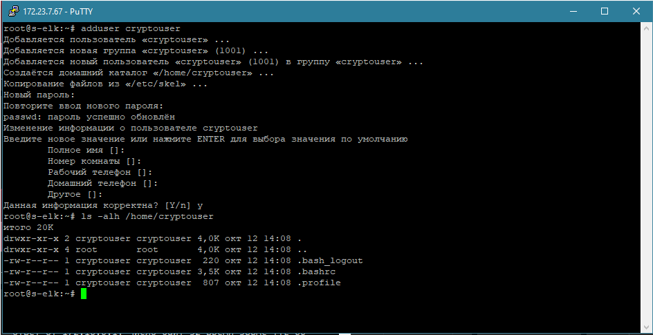
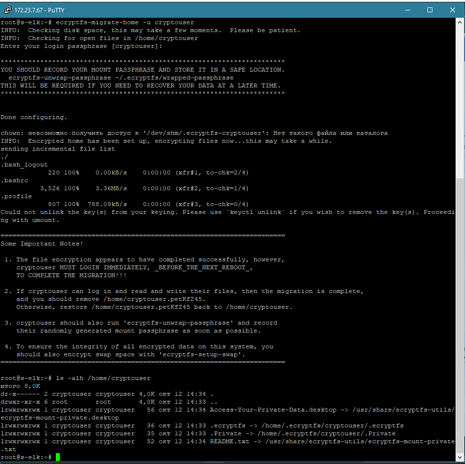

# Домашнее задание к занятию  «Защита хоста» - Бровко Иван Геннадьевич

------

### Задание 1

1. Установите **eCryptfs**.
2. Добавьте пользователя cryptouser.
3. Зашифруйте домашний каталог пользователя с помощью eCryptfs.

* Устанавливаем ecryptfs-utils
* Шифруем домашний каталог пользователя ecryptfs-migrate-home -u cryptouser
* у меня при шифровании ругнулось, доустановил rsync, и загрузил модуль modprobe ecryptfs

*В качестве ответа  пришлите снимки экрана домашнего каталога пользователя с исходными и зашифрованными данными.*  

* 
* 

### Задание 2

1. Установите поддержку **LUKS**.
2. Создайте небольшой раздел, например, 100 Мб.
3. Зашифруйте созданный раздел с помощью LUKS.

* процесс
- Установлю Luks   apt install cryptsetup
- cryptsetup luksFormat /dev/sdb1
- cryptsetup open /dev/sdb encrypted
- mkfs.ext4 /dev/mapper/encrypted

* если необходимо примонтировать
- mount -t ext4 /dev/mapper/encrypted /mnt/encrypted

* Чтобы отключить зашифрованный раздел
- umount /mnt/encrypted
- cryptsetup close encrypted

*В качестве ответа пришлите снимки экрана с поэтапным выполнением задания.*

## Дополнительные задания (со звёздочкой*)

Эти задания дополнительные, то есть не обязательные к выполнению, и никак не повлияют на получение вами зачёта по этому домашнему заданию. Вы можете их выполнить, если хотите глубже шире разобраться в материале

### Задание 3 *

1. Установите **apparmor**.
2. Повторите эксперимент, указанный в лекции.
3. Отключите (удалите) apparmor.

*В качестве ответа пришлите снимки экрана с поэтапным выполнением задания.*

