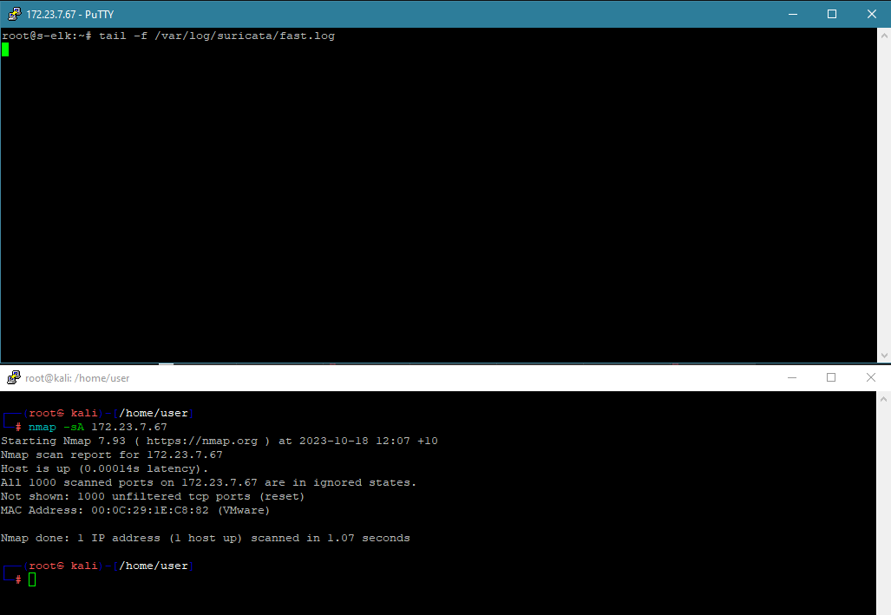
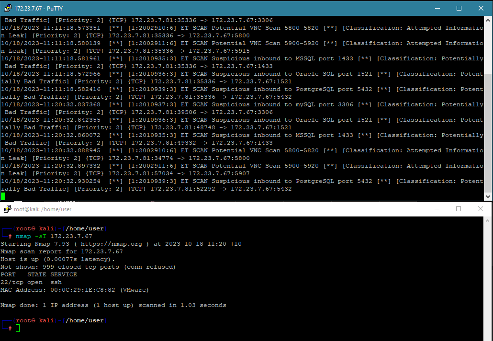
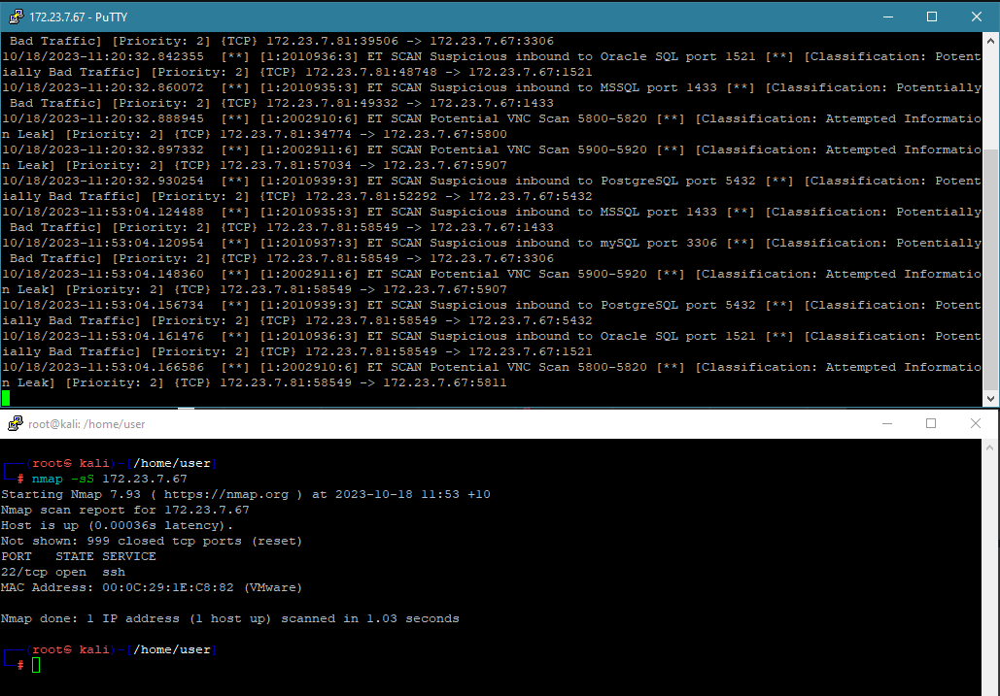
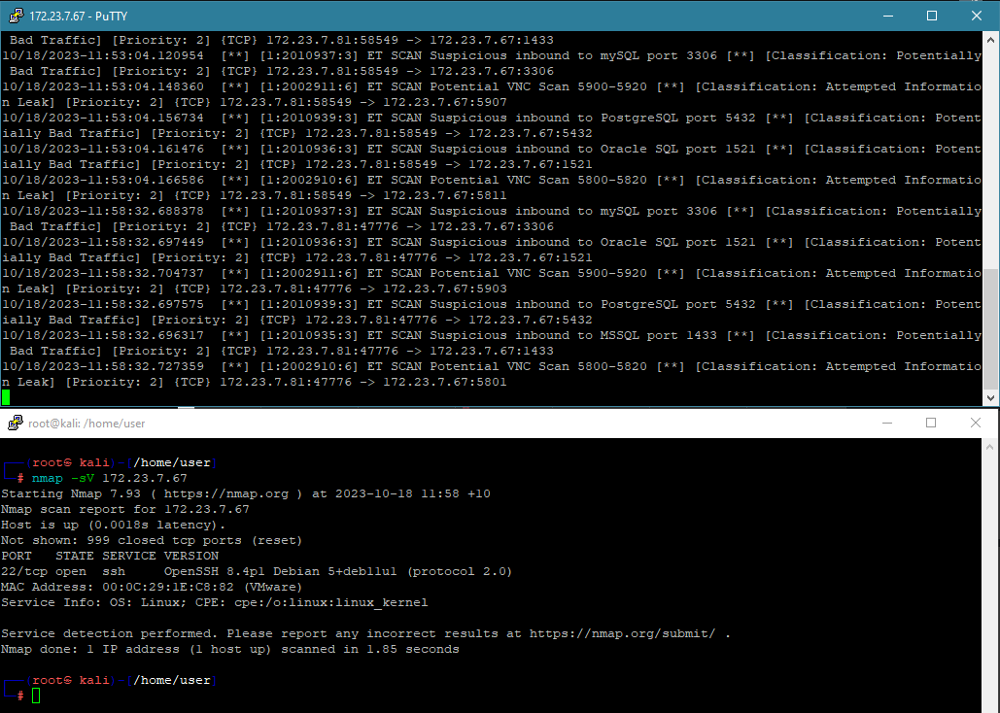
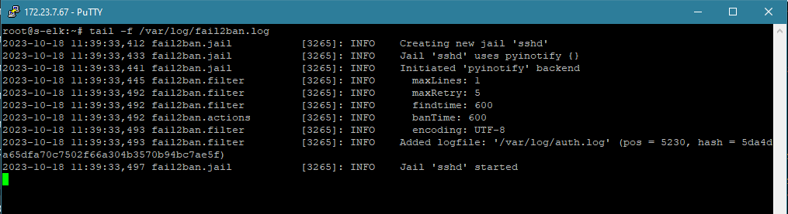
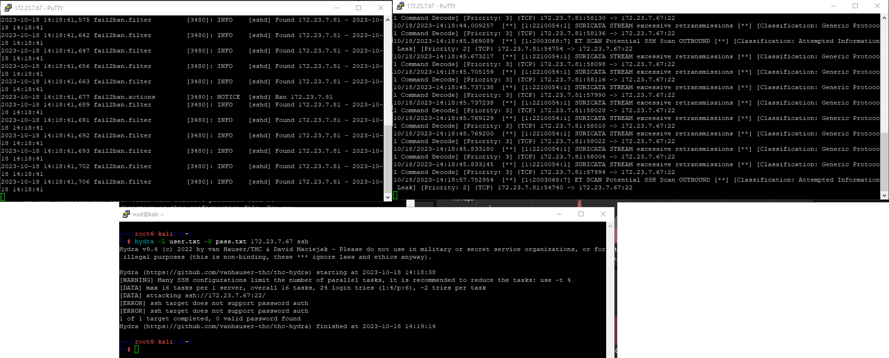
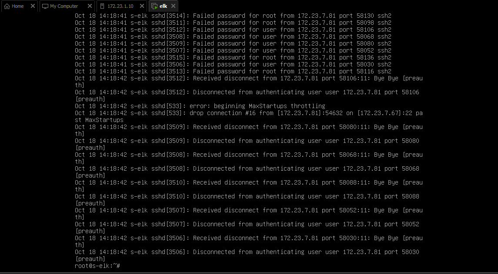

# Домашнее задание к занятию «Защита сети» - Бровко Иван Геннадьевич

------

### Подготовка к выполнению заданий

1. Подготовка защищаемой системы:

- установите **Suricata**,
- установите **Fail2Ban**.

**Защищаемая система подготовлена** - debian 11, ip 172.23.7.67/17

2. Подготовка системы злоумышленника: установите **nmap** и **thc-hydra** либо скачайте и установите **Kali linux**.

Обе системы должны находится в одной подсети.

**Система злоумышленника подготовлена** - kali linux, ip 172.7.81/17

------

### Задание 1

Проведите разведку системы и определите, какие сетевые службы запущены на защищаемой системе:

**sudo nmap -sA < ip-адрес >**
* 
* как видим при таком сканировании в log suricata ничего не попало

**sudo nmap -sT < ip-адрес >**
* 
* в log suricata попали события сканирования портов с хоста 7.81 с разными классификациями
* например сканирование порта 3306 попало в лог с классификацией - потенциально нехороший трафик
* а сканирование порта 5800-5820 попало в лог с классификацией -  потенциальная утечка информации
* и тд

**sudo nmap -sS < ip-адрес >**
* 
* в log suricata попали события сканирования портов с хоста 7.81 с разными классификациями
* сканирование порта 5432 попало в лог с классификацией -  потенциальная утечка информации
* и тд

**sudo nmap -sV < ip-адрес >**
* 
* так же в log suricata попали события сканирования разных портов с хоста 7.81 с разными классификациями

* все вышеперечисленные события в логах suricata сообщают нам о том что кто то или чтото пытается сканировать нашу систему
* и нам следует предпринять шаги для защиты если это еще небыло сделано ранее.
* возможно это злоумышленник, но так же может быть что это некое програмное обеспечение которое сканирует подсети, например сервис KSC может производить некое скаинрование и suricata зафиксирует это.

* в лог fail2ban при сканировании портов(потенциальных уязвимостей ничего не попало) , в лог попадет инфа при попытки получения доступа
* например к порту 22, в задании №2 будем использовать гидру и вот тогда увидим инфу в логах fail2ban.
* 

*В качестве ответа пришлите события, которые попали в логи Suricata и Fail2Ban, прокомментируйте результат.*

------

### Задание 2

Проведите атаку на подбор пароля для службы SSH:

**hydra -L users.txt -P pass.txt < ip-адрес > ssh**

1. Настройка **hydra**: 
 
 - создайте два файла: **users.txt** и **pass.txt**;
 - в каждой строчке первого файла должны быть имена пользователей, второго — пароли. В нашем случае это могут быть случайные строки, но ради эксперимента можете добавить имя и пароль существующего пользователя.

Дополнительная информация по **hydra**: https://kali.tools/?p=1847.

2. Включение защиты SSH для Fail2Ban:

-  открыть файл /etc/fail2ban/jail.conf,
-  найти секцию **ssh**,
-  установить **enabled**  в **true**.

Дополнительная информация по **Fail2Ban**:https://putty.org.ru/articles/fail2ban-ssh.html.

**Fail2ban установлен и настроен**
* Fail2ban настроен на три попытки подбора и 5 минут блокировки для тестирования
* 
* в логах suricata видно зафиксированные попытка подбора пароля на порт 22  сервиса ssh
* в логах fail2ban видно срабатывание правил и блокировку ip адреса атакующей машины
* в файле лога /var/log/auth.log зафиксированны попытки входа по ssh
* 

*В качестве ответа пришлите события, которые попали в логи Suricata и Fail2Ban, прокомментируйте результат.*
